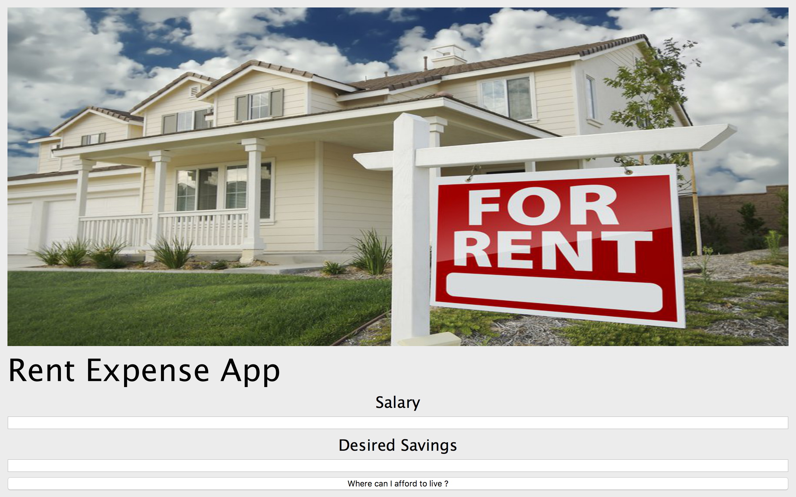
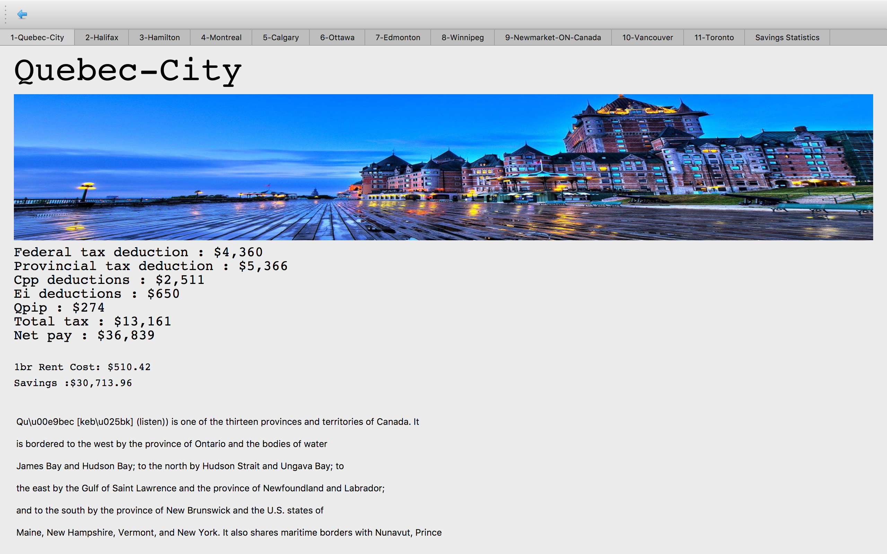
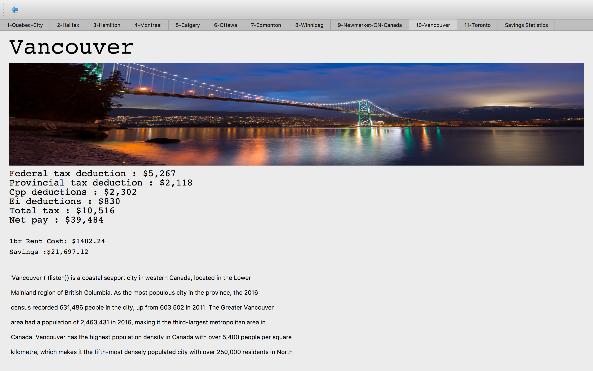

# Rent Expense Application

<h2>Descripton</h2>

 
    The application takes in your salary and desired savings and returns the city you can live in
    based off your savings criteria. The application also computes net income based off provincial taxes
    and provides the amount each tax deduction is in total based off of salary. In addition a wiki description is included         about the city, as well as statics comparing total saved post rent by city.
    
    Please note : The app works best in full screen due to image sizing, double click the top edge of the window to fit pages
    to screen once application is in full screen. 
    

<ul>
  
<h1> Libraries Used </h1>
<li> PyQT  </li>
<li> Matplotlib </li>
<li> Numpy </li>
<li> Seaborn </li>
<li> OS </li>
<li> sqlite3 </li>
<li> BeautifulSoup  </li>

</ul>

<ul>
<h1> Languages Used </h1>
<li> Python  </li>
<li> SQL </li>
</ul>
 
 

# Example Images

<h3> Main page</h3>

<h3>Quebec-City </h3>

<h3> Vancouver </h3>

